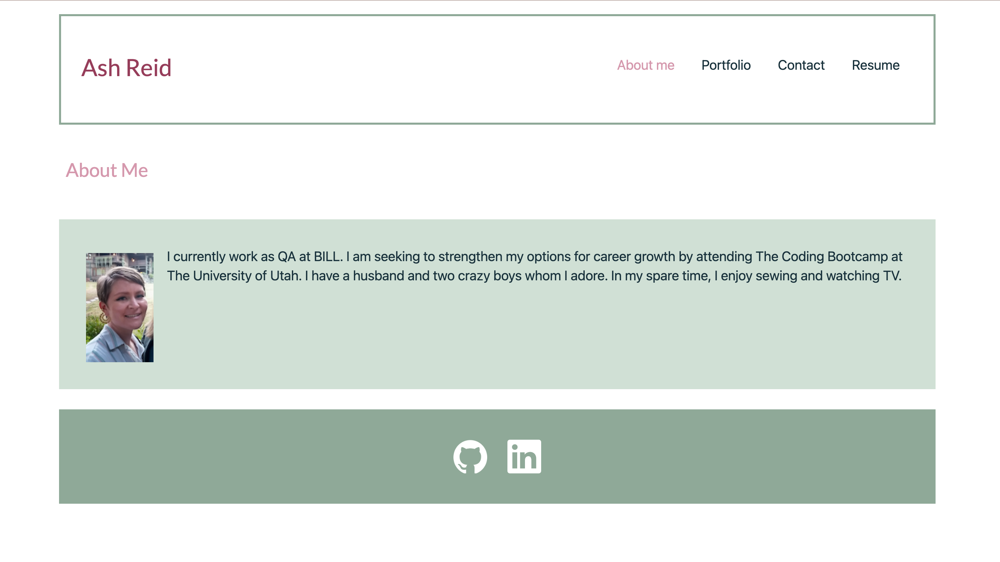

# Portfolio

This portfolio is a re-work of an [older portfolio](https://github.com/ashtreid/candidate-portfolio-portal) and has been reconstructed using React. It serves as a single-page application, employing components to seamlessly display content when users navigate through different tabs without the need for page reloading.

**Portfolio Content:**

1. **Header, Footer, and Navigation:**
   The portfolio incorporates a persistent header, footer, and navigation section, ensuring easy access to key information across all pages. Links to my GitHub and LinkedIn profiles are conveniently placed within the footer.

2. **About Me:**
   The "About Me" section, also functioning as the homepage, provides a small, yet concise, insight into my professional background and personal interests. It offers visitors a glimpse into where I work and some of my core interests.

3. **Portfolio Showcase:**
   The portfolio section showcases various coding projects I have undertaken. Each project is accompanied by detailed information, including links to their corresponding GitHub repositories and live environments. This allows viewers to explore my work in greater detail and interact with the projects themselves.

4. **Contact Information:**
   The "Contact" section features thoughtfully designed input fields, enabling users to easily provide their contact information. To enhance user experience, error messages are incorporated with each field to prompt accurate data entry.

5. **Resume Display:**
   The "Resume" section presents a comprehensive list of my front-end and back-end proficiencies. Visitors can download my complete resume via an accessible link, gaining valuable insights into my skillset and expertise.

With this revamped portfolio, I aim to provide visitors with a streamlined and engaging experience, showcasing my skills, accomplishments, and professional journey in a manner that is both visually appealing and user-friendly. I welcome you to explore my portfolio and discover the projects and expertise that define my passion for web development.

---

  

[le-portfolio repository](https://github.com/ashtreid/le-portfolio) | [le-portfolio live](https://ashtreid.github.io/le-portfolio/)